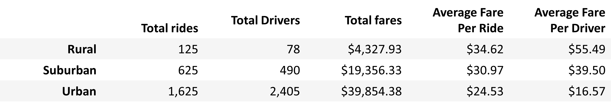
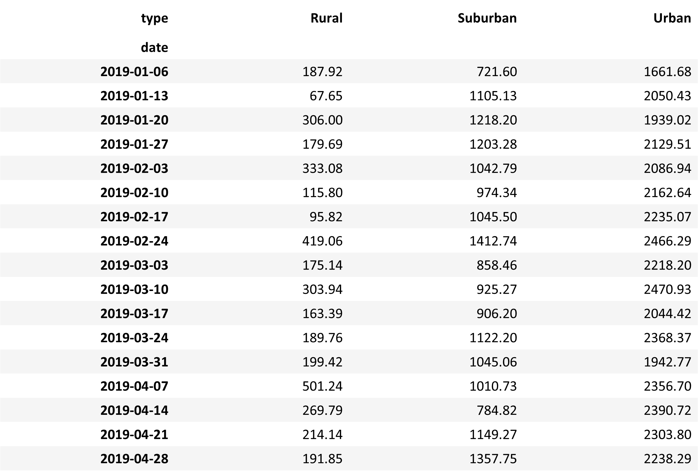
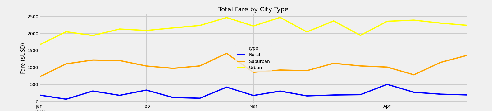

# PyBer_Analysis

## Overview of the analysis
### The purpose of the new analysis
We visualized the rides, drivers and fare price between different city types according to PyBer data. We used graphs and tables to easily understand data using matplotlib, pandas libraries. The objective is to help with decision making for PyBer collaborators to address the differences among the different cities for future implementations and strategies.

Report was requested byV.isualize from Omar and me.

## Results
### Describe the differences in ride-sharing data among the different city types.
We can see that the law of supply and demand really fits the data. Even though, as expected, we can see that un Urban cities we will have much more rides, in reality, the average fer per ride and the average fer per driver is better in rural cities. Anyhow, due to the low amount of rides in rural cities, we can see that the amount of fares (in absolute value) is more in the urban cities. We can appreciate this conclusion from the following table:

Actually, if we want to see if this behaviour happens every week it does. The total fares received in urban cities is always more than in suburban cities and more than in rural cities From pie charts done in previous analysis we found that cities represent more than 60% of the total fares. Please check the table below where we can appreciate this data:

Finally, by looking at this graph, we can see a tendency for urban cities to have bigger total fare is expected because in the city there will always be more people than in rural cities and suburban cities. So, tendencies are not expected to change:

## Summary
### Three business recommendations to the CEO for addressing any disparities among the city types.
The recomendations we would make are:
1. Considering that the average fare per rice is smaller in cities, we might need to incentivize that people use the service for longer distances instead of only short.
2. Since we have less drivers in rural areas, I would try to incentivize drivers to work longer hours so that people in these cities have more probability to find a driver and feel it´s a good idea to use the service.
3. For drivers in Urban cities were their average fare per driver is really small, we could try to incentivize people with a similar route to use the same car. This would help the driver get a bit more money per drive, pollution will be less in that city and a bit less traffic. We could start trying this again as the pandemic has been controlled a bit more lately.
